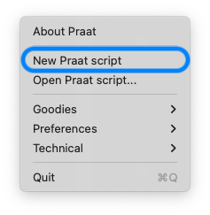
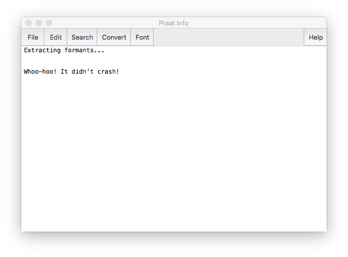
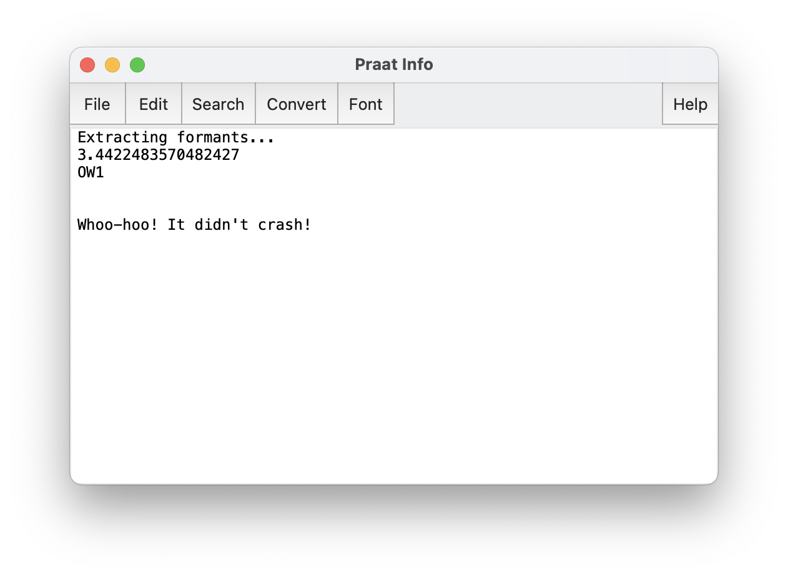

```{r setup, include=FALSE}
knitr::opts_chunk$set(echo = TRUE)
```


# Introduction

This three-part tutorial will walk you through writing a Praat script that extracts vowel formant measurements automatically. Part 1 introduces scripting and focuses only on TextGrids. I'll introduce audio in Part 2 end by the end of it, you should have a basic working script. Part 3 is optional but expands the script to make it more flexible and help you save time later.

::: callout-note
These tutorials are an update to ones I published previously on my personal website. The end product is more or less the same, but the explanation on how to get there has been completely rewritten.
:::

## Data Preparation

I'm going to assume you have audio with phoneme-/segment- and word-level transcriptions. I'll be working with output from the [Montreal Forced Aligner](https://montreal-forced-aligner.readthedocs.io/en/latest/). Specifically, I'll work with a 55-second clip from someone called "02-Carol", who recounts her experience living near Mount St. Helens when it erupted in 1980. 

Here's what Carol's first utterance looks like. (The screenshots from this workshop come from the Praat version 6.2.23 from October 8, 2022.)


The important part to note is that I have the word-level transcription in the second tier, and a phoneme-level transcription—in [ARPABET](http://www.speech.cs.cmu.edu/cgi-bin/cmudict)—in the first tier. I have a third tier with an utterance-level transcription but we won't be needing that for this tutorial. The script we will write should work regardless of how your TextGrid is formatted.

::: callout-note
The Praat scripts in this document will have syntax highlighting, which means certain parts of the script will be colored depending on its function and whether I'm highlighting it or not. In your script, you probably won't see that color. Within each code block, new content is highlighted in blue.
:::

### Pause {-}

Make sure you have Praat installed and running and that you have a TextGrid and a Sound file ready to be used. For now, try to stick with a file that is short (< 5 minutes) because formant extraction takes time.

## Getting Started

To get started, open Praat and load your TextGrid. There are ways to load files in automatically through scripting---which is useful if you need to process many files---but we'll keep it simple for now. Here is what my **Praat Objects** window looks like.


Once you've done that create a script by going to `Praat > New Praat Script`. 



A blank window should open up for you to write your script in.


So now we have our blank canvas. This is where we'll write our script. Be sure to save often!

# Basic Programming in Praat

Let's first cover some basic programming concepts, including one specific to programming in Praat, before we get into how to set up our script.

## Output to the User

It is often very useful to have a Praat script display information to you. For example, you can do a simple "Hello, World!" with the <span class="praat"><span class="k">`writeInfo`</span></span> command (be sure to note the capitalized *I* in <span class="praat"><span class="k">`writeInfo`</span></span>!):

<pre class="praat">
writeInfo: <span class="s">"Hello, World!"</span>
</pre>

When you run this, it'll open a new window, the **Praat Info** window, and will display that text.


There are four variants of this command:

1. <span class="praat"><span class="k">`writeInfo`</span></span> clears whatever text is in the **Praat Info** window and replaces it with your new text.
1. <span class="praat"><span class="k">`writeInfoLine`</span></span> does the same as <span class="praat"><span class="k">`writeInfo`</span></span> but it adds a new line character to the end. In other words, it makes sure that the next thing you write is on a new line rather than as a continuation of the current line.
1. <span class="praat"><span class="k">`appendInfo`</span></span> doesn't erase what was there before and simply appends text to the Praat Info window.
1. <span class="praat"><span class="k">`appendInfoLine`</span></span> does the same as <span class="praat"><span class="k">`appendInfo`</span></span> but with a new line character at the end.

I almost always use <span class="praat"><span class="k">`appendInfoLine`</span></span> for these messages, except for the very first one in a script which is <span class="praat"><span class="k">`writeInfoLine`</span></span>. I hardly ever use <span class="praat"><span class="k">`writeInfo`</span></span> or <span class="praat"><span class="k">`appendInfo`</span></span>. 

To make sure that Praat is running, let's put something useful at the start of our script, just to let us know what's going on.

<pre class="praat">
<span class="k">writeInfoLine</span>: <span class="s">"Extracting formants..."</span>
</pre>

Now, every time you run the script, you'll get that message. I also like to end my scripts with a little message saying that it's done, just so I know that the script didn't crash. 

<pre class="praat">
<span class="k">appendInfoLine</span>: newline$, newline$ <span class="s">"Whoo-hoo! It didn't crash!"</span>
</pre>

So at this point, your script should match the following block of code, and when you run it your **Praat Info** box should be the same as mine.

<pre class="praat">
<b><span class="k">writeInfoLine</span>: <span class="s">"Extracting formants..."</span></b>
<b><span class="k">appendInfoLine</span>: newline$, newline$, <span class="s">"Whoo-hoo! It didn't crash!"</span></b>
</pre>


So far this script is pretty useless. Let's actually get it to work for you.


## Getting info from the Praat Objects Window

The secret to Praat scripting is that pretty much everything you can do in a script can be done with pointing and clicking in the **Praat** Objects window (the main one that lists all your objects). For example, let's say we want to get the start time of the first phoneme in our TextGrid. We can of course see that it's around 3.44 seconds in the the audio in the **View and Edit** window


But did you know we can also get that information without even going to the **View and Edit** window? Click on the TextGrid and, from the dynamic menu, click on `Query > Query interval tier > Get start time of interval...`.


You'll be taken to a small window that then gives you a chance to specify which interval you want to do. (Praat calls this a *form* instead of a *window* because it takes user input and does something with it.) In my case, I want tier 1 and interval 2.


How did I know that those are the numbers I want? I got them from the **View and Edit** window. On the left you can see the tier numbers and on the right of that tier you can see the interval numbers.  


So, when I hit OK on the **TextGrid: Get start time of interval** window, I see that I now have an updated **Praat Info** window that has the start time (with perhaps more precision than we care for).


So, what this little exercise shows is that pretty much any information you need to get from Praat you can do so directly in the **Praat Objects** window. 

## Copying Praat's history

Okay, so why go through all the hard work of getting info through the **Praat Objects** window when I can just do it through the **View and Edit** window? Well the reason is because Praat actually records every click you do in the **Praat Objects** window. And when we view that record of clicks, it's actually valid Praat code. We can then incorporate this code into our script do make our script do something similar, but fully automatically. Let's see this in action.

In your **Praat script** window, click on `Edit > Paste history`:


In your Praat script, you'll now see a flood of new code. This shows all the clicks you've done in Praat in the **Praat Objects** window since you opened Praat. The important one is what should be the very bottom one: `Get start time of interval: 1, 2`.  


This last line of code is the one you want. Notice that the name of the function, `Get start time of interval`, matches the menu command that we clicked on earlier. The `1` following it refers to the tier that we want to query and the `2` refers to the interval in that tier that we want to query. Those numbers (and their order) match the **TextGrid: Get start time of interval** form that we saw earlier. 

Basically, this is the line of code that, when incorporated into your script, will get you the start time of the second interval on the first tier. Let's remove everything else from our pasted history and then put that line of code between our print statements we put in earlier. Your script should now look like this: 

<pre class="praat">
<span class="k">writeInfoLine</span>: <span class="s">"Extracting formants..."</span>

<b><span class="k">Get start time of interval</span>: <span class="d">1</span>, <span class="d">2</span></b>

<span class="k">appendInfoLine</span>: newline$, newline$, <span class="s">"Whoo-hoo! It didn't crash!"</span>
</pre>

When you run your script, you should now get the pretty similar output that we had earlier when we did the pointing and clicking: the **Praat Info** window shows the start time with an insane amount of precision. 


It's slightly different though. Where is our first line that says "Extracting formants..."?. It's gone because because the default behavior of `Get start time of interval` is to basically incorporate a `writeInfoLine` print statement into it, which means it erased our anything that was there before. Maybe that's not what we want. Can we change that? Yes!

## Variables

When we extract information from a TextGrid (or any other object in Praat), it's useful to save that information into a *variable* in our Praat script. Without getting into the technical details of what a variable is, basically what we're doing it creating a new temporary storage space within the context of our Praat script that can be used to save information so that we can use it later. 

To illustrate how variables work, let's create a simple script that defines a variable. Here, I'll simply call it `variable`. The name is arbitrary and you can call it `dogfood` if you want. But it's useful to pick informative names. (In my personal style of Praat scripting, I tend to choose names that are more informative at the expense of consiceness.) In that same line, I'll put some information into `variable`, the value `5`. Then, I'll print it out. 

<pre class="praat">
<span class="v">variable</span> = <span class="d">5</span>
<span class="k">writeInfoLine</span>: <span class="v">variable</span>
</pre>

This is a really simple example, but it shows that a value can be stored into some variable and used later.

In our script, we want to make a variable that stores the information about the start time of the interval we're interested in. Let's create a variable called `start_time` and put the value of the start time into it.

<pre class="praat">
<span class="k">writeInfoLine</span>: <span class="s">"Extracting formants..."</span>

<b><span class="v">start_time</span> = </b><span class="k">Get start time of interval</span>: <span class="d">1</span>, <span class="d">2</span>

<span class="k">appendInfoLine</span>: newline$, newline$, <span class="s">"Whoo-hoo! It didn't crash!"</span>
</pre>

Now, when we run our script, what do we get?


We see our "Extracting formant..." line, but now we don't see the start time! Have we done anything? Well, now that we've saved the output to a variable, it doesn't print it out by default anymore. We need to explicitly print this out ourselves. We can easy do this with another `appendInfoLine` statement:

<pre class="praat">
<span class="k">writeInfoLine</span>: <span class="s">"Extracting formants..."</span>

<span class="v">start_time</span> = <span class="k">Get start time of interval</span>: <span class="d">1</span>, <span class="d">2</span>
<b><span class="k">appendInfoLine</span>: <span class="v">start_time</span></b>

<span class="k">appendInfoLine</span>: newline$, newline$, <span class="s">"Whoo-hoo! It didn't crash!"</span>
</pre>

When we run our script now, we get everything we want:


For me, another use of variables is to make the code clearer. For example, in the `Get start time of interval: 1, 2` line of code, I tend to forget if the `1` refers to the tier and the `2` refers to the interval or vice versa. So, I like to specify tier numbers in a variable, and then anytime I need to use a tier number, I call that variable. I'll create a tier called `phoneme_tier` and use that in my script instead.

<pre class="praat">
<span class="k">writeInfoLine</span>: <span class="s">"Extracting formants..."</span>

<b><span class="v">phoneme_tier</span> = <span class="d">1</span></b>

<span class="v">start_time</span> = <span class="k">Get start time of interval</span>: <b><span class="v">phoneme_tier</span></b>, <span class="d">2</span>
<span class="k">appendInfoLine</span>: <span class="v">start_time</span>

<span class="k">appendInfoLine</span>: newline$, newline$, <span class="s">"Whoo-hoo! It didn't crash!"</span>
</pre>

The output will be identical but, in my opinion, the code is easier to read. 

## Practice with another query: labels

Let's see this process in action again, just to solidify what's going on. Another piece of information that we might want from our TextGrid is the actual text inside that interval. It's great that the start time is about 3.44 seconds into the audio, but it might be nice to know *what* the phoneme is. Try clicking around the **Praat Objects** window and see if you can find the right command. 

As it turns out, the command you want is `Query > Query interval tier > Get label of interval`. Praat calls the text inside of an interval the *label*. When I run this command, we again get a form that asks for the tier and the interval number. In my case, I'll stick with tier 1 and interval 2. 


The result is the text `OW1` showing up in my **Praat Info** window. That's exactly what I need.


I'll incorporate this into my script by pasting my history into the Praat script. Go back to your Praat script (maybe click down at the very bottom so it doesn't mess up your existing script) and click on `Edit > Paste history`. The command you want is `Get label of interval`. 


I'll cut that line of code and paste it into my sccript right below the two lines that gets and prints the start time.

<pre class="praat">
<span class="k">writeInfoLine</span>: <span class="s">"Extracting formants..."</span>

<span class="v">phoneme_tier</span> = <span class="d">1</span>

<span class="v">start_time</span> = <span class="k">Get start time of interval</span>: <span class="v">phoneme_tier</span>, <span class="d">2</span>
<span class="k">appendInfoLine</span>: <span class="v">start_time</span>

<b><span class="k">Get label of interval</span>: <span class="d">1</span>, <span class="d">2</span></b>

<span class="k">appendInfoLine</span>: newline$, newline$, <span class="s">"Whoo-hoo! It didn't crash!"</span>
</pre>

We should probably change it though, just like we did with `Get start time of interval`. Instead of `1`, I'll put `phoneme_tier`. So, currently, the script looks like this:

<pre class="praat">
<span class="k">writeInfoLine</span>: <span class="s">"Extracting formants..."</span>

<span class="v">phoneme_tier</span> = <span class="d">1</span>

<span class="v">start_time</span> = <span class="k">Get start time of interval</span>: <span class="v">phoneme_tier</span>, <span class="d">2</span>
<span class="k">appendInfoLine</span>: <span class="v">start_time</span>

<span class="k">Get label of interval</span>: <b><span class="v">phoneme_tier</span></b>, <span class="d">2</span>

<span class="k">appendInfoLine</span>: newline$, newline$, <span class="s">"Whoo-hoo! It didn't crash!"</span>
</pre>

But, like we saw earlier, getting information from the TextGrid without saving it is going to do unexpected things, like overwrite what you had printed already. So, just like we did with `Get start time of interval`, we'll save the output of `Get label of interval` into a variable. We can then do a new print statement that will print it out. 

<pre class="praat">
<span class="k">writeInfoLine</span>: <span class="s">"Extracting formants..."</span>

<span class="v">phoneme_tier</span> = <span class="d">1</span>

<span class="v">start_time</span> = <span class="k">Get start time of interval</span>: <span class="v">phoneme_tier</span>, <span class="d">2</span>
<span class="k">appendInfoLine</span>: <span class="v">start_time</span>

<b><span class="v">phoneme_label</span> = </b><span class="k">Get label of interval</span>: <span class="v">phoneme_tier</span>, <span class="d">2</span>
<b><span class="k">appendInfoLine</span>: <span class="v">phoneme_label</span></b>

<span class="k">appendInfoLine</span>: newline$, newline$, <span class="s">"Whoo-hoo! It didn't crash!"</span>
</pre>

Oops. Did the script not work for you too? Did this error complain about the function returning a string and that it was not assigned to a numeric variable? 


What's going on here? As it turns out, Praat *really* cares about whether a variable contains text (which, in computer terms, is called a *string*) or a number. It cares so much in fact that when you make variable names, you have to explicity specifiy if that variable is going to contain a string. So far, we haven't had to worry about this because `start_time` and `phoneme_tier` are both numbers so we didn't have to do anything. But the label of an interval is a string, which means we do have to worry about it. 

Fortunately the fix is simple. All we need to do is add a `$` at the end of a variable name if that variable contains a string. So, instead of `phoneme_label`, it should be `phoneme_label$`. (The `$` is sort of a stylized *s*, which stands for *string*. And we've already seen it in `newline$`) So, we can make these small changes to the script, both when we declare the variable and when we use it in the print statement, and it should work just fine. 

<pre class="praat">
<span class="k">writeInfoLine</span>: <span class="s">"Extracting formants..."</span>

<span class="v">phoneme_tier</span> = <span class="d">1</span>

<span class="v">start_time</span> = <span class="k">Get start time of interval</span>: <span class="v">phoneme_tier</span>, <span class="d">2</span>
<span class="k">appendInfoLine</span>: <span class="v">start_time</span>

<span class="v">phoneme_label<b>$</b></span> = <span class="k">Get label of interval</span>: <span class="v">phoneme_tier</span>, <span class="d">2</span>
<span class="k">appendInfoLine</span>: <span class="v">phoneme_label<b>$</b></span>

<span class="k">appendInfoLine</span>: newline$, newline$, <span class="s">"Whoo-hoo! It didn't crash!"</span>
</pre>

Now we get the expected output: the **Praat Info** window prints out both the start time and the label of the interval. 




## Expanding the print statement

Currently the output gives us the information that we want, but not really much more than that. It might be useful to contextualize it a little bit. We can expand the `appendInfoLine` statement to include additional content if we want. So, for example, we can make it say something like "The phoneme OW1 starts at 3.44." 

This is pretty straightforward. You can just put multiple things on a single print statement as long as they're separated by commas. (We've seeen this alredy in the last line of code with the `newline$`s.) So, we can collapse our two print statements down to one, with a little bit of contextualization with this:

<pre class="praat">
<span class="k">writeInfoLine</span>: <span class="s">"Extracting formants..."</span>

<span class="v">phoneme_tier</span> = <span class="d">1</span>

<span class="v">start_time</span> = <span class="k">Get start time of interval</span>: <span class="v">phoneme_tier</span>, <span class="d">2</span>
<span class="v">phoneme_label$</span> = <span class="k">Get label of interval</span>: <span class="v">phoneme_tier</span>, <span class="d">2</span>
<b><span class="k">appendInfoLine</span>: <span class="s">"The phoneme "</span>, <span class="v">phoneme_label$</span>, <span class="s">" starts at "</span>, <span class="v">start_time</span>, <span class="s">"."</span></b>

<span class="k">appendInfoLine</span>: newline$, newline$, <span class="s">"Whoo-hoo! It didn't crash!"</span>
</pre>

Running this script gives us the following output, which is a little more informative to the user (i.e. you).


When formatting these print statements, watch out for spaces and don't forget ending punctuation if you want it!

## Cleaning up the script

Before we move on, let's pause and just add a few more things. First, the amount of precision in that start time is just too much. Let's round it down to something more reasonable like the millisecond. We can do this with the `fixed$()` function. Just like the `Get start time of interval`, this function requires two pieces of information (a.k.a *arguments*) to run properly: the number that we're rounding, and how many decimal places to round to. In our case, we want to round the contents of the `start_time` variable and then we want to round it to three decimal places. We can incorporate this whole thing into our `appendInfoLine` statement:

<pre class="praat">
<span class="k">writeInfoLine</span>: <span class="s">"Extracting formants..."</span>

<span class="v">phoneme_tier</span> = <span class="d">1</span>

<span class="v">start_time</span> = <span class="k">Get start time of interval</span>: <span class="v">phoneme_tier</span>, <span class="d">2</span>
<span class="v">phoneme_label$</span> = <span class="k">Get label of interval</span>: <span class="v">phoneme_tier</span>, <span class="d">2</span>
<span class="k">appendInfoLine</span>: <span class="s">"The phoneme "</span>, <span class="v">phoneme_label$</span>, <span class="s">" starts at "</span>, <b><span class="k">fixed$(</span></b><span class="v">start_time</span><b>, <span class="d">3</span><span class="k">)</span></b>, <span class="s">"."</span>

<span class="k">appendInfoLine</span>: newline$, newline$, <span class="s">"Whoo-hoo! It didn't crash!"</span>
</pre>

Now when we run our script, it'll print a shorter number. 

Another thing that we may want to do is to start commenting our code. When you start a line of code in Praat with a `#`, Praat will ignore anything on that line. This is useful because it allows you to put comments and notes in your script. This helps you remember what things are doing and why you're doing them because you will most likely forget later on. I'll put some comments now and you should too.

<pre class="praat">
<b><span class="c"># Start the script</span></b>
<span class="k">writeInfoLine</span>: <span class="s">"Extracting formants..."</span>

<b><span class="c"># Create a variable</span></b>
<span class="v">phoneme_tier</span> = <span class="d">1</span>

<b><span class="c"># Get the label and start time and print a rounded version</span></b>
<span class="v">start_time</span> = <span class="k">Get start time of interval</span>: <span class="v">phoneme_tier</span>, <span class="d">2</span>
<span class="v">phoneme_label$</span> = <span class="k">Get label of interval</span>: <span class="v">phoneme_tier</span>, <span class="d">2</span>
<span class="k">appendInfoLine</span>: <span class="s">"The phoneme "</span>, <span class="v">phoneme_label$</span>, <span class="s">" starts at "</span>, <span class="k">fixed$(</span><span class="v">start_time</span>, <span class="d">3</span><span class="k">)</span>, <span class="s">"."</span>

<b><span class="c"># Make sure the script finished</span></b>
<span class="k">appendInfoLine</span>: newline$, newline$, <span class="s">"Whoo-hoo! It didn't crash!"</span>
</pre>

# Hopping tiers

So far, our script is working fine and we're starting to get some useful information about intervals in a tier. However, sometimes it's nice to get information about *another* tier at that same time point. For example, it'd be nice to know what word our phonemes came from. The word information is stored in a different tier than the phoneme info, so we're going to have to hop tiers. 

Fortunately there's a pretty straightforward way of doing that and the way that we can do it involves a little bit of thinking backwards about how we accomplished a task.

Consider the function `Get start time of interval`. The piece of information we're looking for is the start time, and the piece of information we have already is the interval number. What if we turned it around? Can we get an interval number given a time point like 5 seconds into the recording?

Clicking around in the **Praat Objects** window, you'll eventually find `Query > Query interval tier > Get interval at time`. Here, we're presented with two arguments: the tier number and the time, in seconds, into the recording that you want to query. If I want to see what interval number is on the phoneme tier at 5 seconds into my recording, I can use that function to get the result: 18.


When we compare this to what we get in the **View and Edit** window, it checks out. Five seconds into tier 1 is the 18th interval. 


Right now, it may not be immediately obvious why that's important. After all, we're not hopping from one interval to the next within the same tier, are we? No. But, what is useful is, given a time, like the time of a phoneme, we can see the interval number on the *word* tier and then use that to query information about the word. In our case, the word interval at 3.44 seconds into the recording is interval 2. 


Let's incorporate that function into our script. Again, paste your history into your TextGrid, grab the `Get interval at time` function and delete the rest. I'll also swap out the `5` that was hard-coded in and put in the `start_time` variable so that it gets the word interval corresponding to the start time of the phoneme. 

<pre class="praat">
<span class="c"># Start the script</span>
<span class="k">writeInfoLine</span>: <span class="s">"Extracting formants..."</span>

<span class="c"># Create a variable</span>
<span class="v">phoneme_tier</span> = <span class="d">1</span>

<span class="c"># Get the label and start time and print a rounded version</span>
<span class="v">start_time</span> = <span class="k">Get start time of interval</span>: <span class="v">phoneme_tier</span>, <span class="d">2</span>
<span class="v">phoneme_label$</span> = <span class="k">Get label of interval</span>: <span class="v">phoneme_tier</span>, <span class="d">2</span>
<span class="k">appendInfoLine</span>: <span class="s">"The phoneme "</span>, <span class="v">phoneme_label$</span>, <span class="s">" starts at "</span>, <span class="k">fixed$(</span><span class="v">start_time</span>, <span class="d">3</span><span class="k">)</span>, <span class="s">"."</span>

<b><span class="c"># Get information about the word</span></b>
<b><span class="k">Get interval at time</span>: <span class="d">2</span>, <span class="v">start_time</span></b>

<span class="c"># Make sure the script finished</span>
<span class="k">appendInfoLine</span>: newline$, newline$, <span class="s">"Whoo-hoo! It didn't crash!"</span>
</pre>

But, we can make this more robust, right? We can do what we did with the other functions and replace the tier number with a variable. That'll make the code easier and it'll make it easier to modify down the road if we use this script on another file.

<pre class="praat">
<span class="c"># Start the script</span>
<span class="k">writeInfoLine</span>: <span class="s">"Extracting formants..."</span>

<span class="c"># Create global variables</span>
<span class="v">phoneme_tier</span> = <span class="d">1</span>
<b><span class="v">word_tier</span> = <span class="d">2</span></b>

<span class="c"># Get the label and start time and print a rounded version</span>
<span class="v">start_time</span> = <span class="k">Get start time of interval</span>: <span class="v">phoneme_tier</span>, <span class="d">2</span>
<span class="v">phoneme_label$</span> = <span class="k">Get label of interval</span>: <span class="v">phoneme_tier</span>, <span class="d">2</span>
<span class="k">appendInfoLine</span>: <span class="s">"The phoneme "</span>, <span class="v">phoneme_label$</span>, <span class="s">" starts at "</span>, <span class="k">fixed$(</span><span class="v">start_time</span>, <span class="d">3</span><span class="k">)</span>, <span class="s">"."</span>

<span class="c"># Get information about the word</span>
<span class="k">Get interval at time</span>: <b><span class="v">word_tier</span></b>, <span class="v">start_time</span>

<span class="c"># Make sure the script finished</span>
<span class="k">appendInfoLine</span>: newline$, newline$, <span class="s">"Whoo-hoo! It didn't crash!"</span>
</pre>

Of course, when we run this it's going to do weird things because we didn't save the output into a variable. So let's do that and then print the output as well.

<pre class="praat">
<span class="c"># Start the script</span>
<span class="k">writeInfoLine</span>: <span class="s">"Extracting formants..."</span>

<span class="c"># Create global variables</span>
<span class="v">phoneme_tier</span> = <span class="d">1</span>
<span class="v">word_tier</span> = <span class="d">2</span>

<span class="c"># Get the label and start time and print a rounded version</span>
<span class="v">start_time</span> = <span class="k">Get start time of interval</span>: <span class="v">phoneme_tier</span>, <span class="d">2</span>
<span class="v">phoneme_label$</span> = <span class="k">Get label of interval</span>: <span class="v">phoneme_tier</span>, <span class="d">2</span>
<span class="k">appendInfoLine</span>: <span class="s">"The phoneme "</span>, <span class="v">phoneme_label$</span>, <span class="s">" starts at "</span>, <span class="k">fixed$(</span><span class="v">start_time</span>, <span class="d">3</span><span class="k">)</span>, <span class="s">"."</span>

<span class="c"># Get information about the word</span>
<b><span class="b">word_interval</span> = </b><span class="k">Get interval at time</span>: <span class="v">word_tier</span>, <span class="v">start_time</span>
<b><span class="k">appendInfoLine</span>: <span class="s">"The word interval is "</span>, <span class="b">word_interval</span></b>

<span class="c"># Make sure the script finished</span>
<span class="k">appendInfoLine</span>: newline$, newline$, <span class="s">"Whoo-hoo! It didn't crash!"</span>
</pre>

These four steps---getting the function from the history, replacing values with variables, setting the output to a variable, and printing the output---are the secret to Praat scripting. 

Okay, so the interval number isn't super helpful for us, but we can use that number to get information that *is* useful. For example, we can now use that number to get the label of the word. The way this is done is pretty much the same as how we did it with the phoneme. 

<pre class="praat">
<span class="c"># Start the script</span>
<span class="k">writeInfoLine</span>: <span class="s">"Extracting formants..."</span>

<span class="c"># Create global variables</span>
<span class="v">phoneme_tier</span> = <span class="d">1</span>
<span class="v">word_tier</span> = <span class="d">2</span>

<span class="c"># Get the label and start time and print a rounded version</span>
<span class="v">start_time</span> = <span class="k">Get start time of interval</span>: <span class="v">phoneme_tier</span>, <span class="d">2</span>
<span class="v">phoneme_label$</span> = <span class="k">Get label of interval</span>: <span class="v">phoneme_tier</span>, <span class="d">2</span>
<span class="k">appendInfoLine</span>: <span class="s">"The phoneme "</span>, <span class="v">phoneme_label$</span>, <span class="s">" starts at "</span>, <span class="k">fixed$(</span><span class="v">start_time</span>, <span class="d">3</span><span class="k">)</span>, <span class="s">"."</span>

<span class="c"># Get information about the word</span>
<span class="b">word_interval</span> = <span class="k">Get interval at time</span>: <span class="v">word_tier</span>, <span class="v">start_time</span>
<b><span class="v">word_label$</span> = <span class="k">Get label of interval</span>: <span class="v">word_tier</span>, <span class="v">word_interval</span></b>
<b><span class="k">appendInfoLine</span>: <span class="s">"The word is "</span>, <span class="b">word_label$</span></b>

<span class="c"># Make sure the script finished</span>
<span class="k">appendInfoLine</span>: newline$, newline$, <span class="s">"Whoo-hoo! It didn't crash!"</span>
</pre>

In fact, we can incorporate this all into one print statement now.

<pre class="praat">
<span class="c"># Start the script</span>
<span class="k">writeInfoLine</span>: <span class="s">"Extracting formants..."</span>

<span class="c"># Create global variables</span>
<span class="v">phoneme_tier</span> = <span class="d">1</span>
<span class="v">word_tier</span> = <span class="d">2</span>

<span class="c"># Get the label and start time and print a rounded version</span>
<span class="v">start_time</span> = <span class="k">Get start time of interval</span>: <span class="v">phoneme_tier</span>, <span class="d">2</span>
<span class="v">phoneme_label$</span> = <span class="k">Get label of interval</span>: <span class="v">phoneme_tier</span>, <span class="d">2</span>

<span class="c"># Get information about the word</span>
<span class="b">word_interval</span> = <span class="k">Get interval at time</span>: <span class="v">word_tier</span>, <span class="v">start_time</span>
<span class="v">word_label$</span> = <span class="k">Get label of interval</span>: <span class="v">word_tier</span>, <span class="v">word_interval</span>

<b><span class="c"># Print it out</span></b>
<b><span class="k">appendInfoLine</span>: <span class="s">"The word """</span>, <span class="b">word_label$</span>, <span class="s">""" contains the phoneme "</span>, 
        ...<span class="v">phoneme_label$</span>, <span class="s">", which starts at "</span>, <span class="k">fixed$(</span><span class="v">start_time</span>, <span class="d">3</span><span class="k">)</span>, <span class="s">"."</span></b>

<span class="c"># Make sure the script finished</span>
<span class="k">appendInfoLine</span>: newline$, newline$, <span class="s">"Whoo-hoo! It didn't crash!"</span>
</pre>

I've done a few tricks with this print statement. One, in order to print a double quote you have to type a double quote twice: `""`. Two, because the line was getting a little too long, I continued it onto the next line and started that line with `...`. 

## Calculating the midpoint

That appears to work, but in the back of my mind I always wonder whether the start time of the interval is the most secure way to do it. If the phoneme and word start and precisely the same time, who knows maybe there could be some rounding error and it returns the previous word instead of the current word. To play it safe, I like to calculate the midpoint of the vowel and use that point instead. 

What information do we need to calculate the midpoint of the vowel? Well, what is the midpoint? It's a point halfway between the start and end time. Another way of thinking about it is that it's the start time plus half of the duration. So, we need the start time, which we have already. We also need the end time. With both of those numbers, we can then calculate the duration. And then we can get the midpoint. Let's start by getting the end time. 

To get the function for calculating the end time, go to `Query > Query interval tier > Get end time of interval`. (You might be able to guess that the function would be `Get end time of interval` just based on `Get start time of interval`, but it's nice to play it safe and go through the **Praat Objects** window anyway.) The syntax is identical, so it should be easy to incorporate this into our script. (I'll just show the relevant portion of the script for right now.)

<pre class="praat">
<span class="c"># Get the start and end times</span>
<span class="v">start_time</span> = <span class="k">Get start time of interval</span>: <span class="v">phoneme_tier</span>, <span class="d">2</span>
<b><span class="v">end_time</span> = <span class="k">Get end time of interval</span>: <span class="v">phoneme_tier</span>, <span class="d">2</span></b>
</pre>

So now that we have those two pieces of information let's calculate the duration. The duration of a vowel (or anything, really), is just the end time minus the start time. Let's do that and save it to a variable.

<pre class="praat">
<span class="c"># Get the duration</span>
<span class="v">start_time</span> = <span class="k">Get start time of interval</span>: <span class="v">phoneme_tier</span>, <span class="d">2</span>
<span class="v">end_time</span> = <span class="k">Get end time of interval</span>: <span class="v">phoneme_tier</span>, <span class="d">2</span>
<b><span class="v">duration</span> = <span class="v">end_time</span> - <span class="v">start_time</span></b>
</pre>

And with that, we can now calculate the midpoint.

<pre class="praat">
<span class="c"># Get the midpoint</span>
<span class="v">start_time</span> = <span class="k">Get start time of interval</span>: <span class="v">phoneme_tier</span>, <span class="d">2</span>
<span class="v">end_time</span> = <span class="k">Get end time of interval</span>: <span class="v">phoneme_tier</span>, <span class="d">2</span>
<span class="v">duration</span> = <span class="v">end_time</span> - <span class="v">start_time</span>
<b><span class="v">midpoint</span> = <span class="v">start_time</span> + <span class="v">duration</span>/<span class="d">2</span></b>
</pre>

We can now incorporate this into our script, and use `midpoint` to get the word interval rather than the start time. 


<pre class="praat">
<span class="c"># Start the script</span>
<span class="k">writeInfoLine</span>: <span class="s">"Extracting formants..."</span>

<span class="c"># Create global variables</span>
<span class="v">phoneme_tier</span> = <span class="d">1</span>
<span class="v">word_tier</span> = <span class="d">2</span>

<span class="c"># Get information about the phoneme</span>
<span class="v">start_time</span> = <span class="k">Get start time of interval</span>: <span class="v">phoneme_tier</span>, <span class="d">2</span>
<b><span class="v">end_time</span> = <span class="k">Get end time of interval</span>: <span class="v">phoneme_tier</span>, <span class="d">2</span></b>
<b><span class="v">duration</span> = <span class="v">end_time</span> - <span class="v">start_time</span></b>
<b><span class="v">midpoint</span> = <span class="v">start_time</span> + <span class="v">duration</span>/<span class="d">2</span></b>
<span class="v">phoneme_label$</span> = <span class="k">Get label of interval</span>: <span class="v">phoneme_tier</span>, <span class="d">2</span>

<span class="c"># Get information about the word</span>
<span class="b">word_interval</span> = <span class="k">Get interval at time</span>: <span class="v">word_tier</span>, <b><span class="v">midpoint</span></b>
<span class="v">word_label$</span> = <span class="k">Get label of interval</span>: <span class="v">word_tier</span>, <span class="v">word_interval</span>

<span class="c"># Print it out</span>
<span class="k">appendInfoLine</span>: <span class="s">"The word """</span>, <span class="b">word_label$</span>, <span class="s">""" contains the phoneme "</span>, 
        ...<span class="v">phoneme_label$</span>, <span class="s">", which starts at "</span>, <span class="k">fixed$(</span><span class="v">start_time</span>, <span class="d">3</span><span class="k">)</span>, <span class="s">"."</span>

<span class="c"># Make sure the script finished</span>
<span class="k">appendInfoLine</span>: newline$, newline$, <span class="s">"Whoo-hoo! It didn't crash!"</span>
</pre>

Again, this is just a precaution. I don't think it has been a problem for me in the past to use `start_time`, but then again, it would be really hard to detect otherwise. Using the midpoint instead is a safer option in my opinion. 


# Loops

Okay, so now we have a script that extracts some information from specific phoneme in our TextGrid. At this point, you might be thinking why we bothered to this this whole rigamarol when we've gotten nothing new from the script that we didn't already have in the **View and Edit** window. Good point. The benefit to all this is that we can incorporate this into a loop and get the start time, end time, duration, midpoint, label, and word of *many* intervals, something that would take you much more time and many more clicks if done manually. 

To show you what I mean, let's record our history of getting the start time of the first ten intervals. Before I start, I'll clear my history by clicking on my Praat script and then click on `Edit > Clear history`. That way when I paste it in I won't have older stuff there distracting me. In the `Get start time of interval` form, I'll first do interval 1, hit `Apply` (which executes the function without closing the form, unlike `OK`), and then 2, and 3, all the way until 10. When I paste my history, it looks something like this:

<pre class="praat">
<span class="k">Get start time of interval</span>: <span class="d">1</span>, <span class="d">1</span>
<span class="k">Get start time of interval</span>: <span class="d">1</span>, <span class="d">2</span>
<span class="k">Get start time of interval</span>: <span class="d">1</span>, <span class="d">3</span>
<span class="k">Get start time of interval</span>: <span class="d">1</span>, <span class="d">4</span>
<span class="k">Get start time of interval</span>: <span class="d">1</span>, <span class="d">5</span>
<span class="k">Get start time of interval</span>: <span class="d">1</span>, <span class="d">6</span>
<span class="k">Get start time of interval</span>: <span class="d">1</span>, <span class="d">7</span>
<span class="k">Get start time of interval</span>: <span class="d">1</span>, <span class="d">8</span>
<span class="k">Get start time of interval</span>: <span class="d">1</span>, <span class="d">9</span>
<span class="k">Get start time of interval</span>: <span class="d">1</span>, <span class="d">10</span>
</pre>

There are several major downsides to this technique. 

1. That took kind of a lot of clicks. And that was only 10 intervals. If we had to do it to 100 or 1000 intervals, that'd take way too long.
1. We only really get the results of the last line of code. Sure, we can copy and paste the start time for each one if we want, but that would take even more clicks.
1. The code is pretty repetitive. Everything about the many lines of code is the same, except for the last number. If we wanted to switch this to focus on theirs 11 through 20, we'd have to update all ten lines of code. 
1. If this were expanded to include more information besides the start time, it would get very tedious very quickly. 

As it turns out, we can automate repetitive processes like these using what's called a `for` loop. Here is a really basic `for` loop in Praat.

<pre class="praat">
<span class="k">for</span> <span class="v">i</span> <span class="k">from</span> <span class="d">1</span> <span class="k">to</span> <span class="d">10</span>
    <span class="k">appendInfoLine:</span>: <span class="s">"My favorite number is "</span>, <span class="v">i</span>
<span class="k">endfor</span>
</pre>


Okay, so let's break this down. We start a "for" loop with `for` and end it with `endfor`. As part of the `for` function, we have a new arbitrarily-named variable that I've decided to call `i`, just out of convention. I'll explain that in just a second. We then have `from 1 to 10`. What's happening is that the code inside of our for loop is going to run 10 times, 10 because we've told it to start from 1 and end at 10. In each interation of the loop, the numbers 1 through 10 are stored in our new variable `i` one at a time. So, the first time through our loop, `i` is equal to 1. The second time through `i` is equal to 2. The tenth time through `i` is equal to 10. So, it ends up printing the statement `"My favorite number is "` ten times, each with a different number.


So, because we now have a variable that increments by one each iteration, it's convenient to then use that variable in `Get start time of interval` and `Get label of interval` to say which interval we want to query. The result is a loop that does the same code 10 times, but on a different interval each time. 

<pre class="praat">
<span class="k">for</span> <span class="v">i_interval</span> <span class="k">from</span> <span class="d">1</span> <span class="k">to</span> <span class="d">10</span>
    <span class="k">Get start time of interval</span>: <span class="d">1</span>, <span class="v">i_interval</span>
<span class="k">endfor</span>
</pre>

That seems to work! We can now incorporate this loop into our main script. Anything that we need to do over and over should go into our loop. And anything that refers to a specific interval number should be replaced with `i_interva`. The script should be something like this:

<pre class="praat">
<span class="c"># Start the script</span>
<span class="k">writeInfoLine</span>: <span class="s">"Extracting formants..."</span>

<span class="c"># Create global variables</span>
<span class="v">phoneme_tier</span> = <span class="d">1</span>
<span class="v">word_tier</span> = <span class="d">2</span>

<b><span class="k">for</span> <span class="v">i_interval</span> <span class="k">from</span> <span class="d">1</span> <span class="k">to</span> <span class="d">10</span></b>
    <span class="c"># Get information about the phoneme</span>
    <span class="v">start_time</span> = <span class="k">Get start time of interval</span>: <span class="v">phoneme_tier</span>, <b><span class="v">i_interval</span></b>
    <span class="v">end_time</span> = <span class="k">Get end time of interval</span>: <span class="v">phoneme_tier</span>, <b><span class="v">i_interval</span></b>
    <span class="v">duration</span> = <span class="v">end_time</span> - <span class="v">start_time</span>
    <span class="v">midpoint</span> = <span class="v">start_time</span> + <span class="v">duration</span>/<span class="d">2</span>
    <span class="v">phoneme_label$</span> = <span class="k">Get label of interval</span>: <span class="v">phoneme_tier</span>, <b><span class="v">i_interval</span></b>

    <span class="c"># Get information about the word</span>
    <span class="b">word_interval</span> = <span class="k">Get interval at time</span>: <span class="v">word_tier</span>, <span class="v">midpoint</span>
    <span class="v">word_label$</span> = <span class="k">Get label of interval</span>: <span class="v">word_tier</span>, <span class="v">word_interval</span>

    <span class="c"># Print it out</span>
    <span class="k">appendInfoLine</span>: <span class="s">"The word """</span>, <span class="b">word_label$</span>, <span class="s">""" contains the phoneme "</span>, 
            ...<span class="v">phoneme_label$</span>, <span class="s">", which starts at "</span>, <span class="k">fixed$(</span><span class="v">start_time</span>, <span class="d">3</span><span class="k">)</span>, <span class="s">"."</span>
<b><span class="v">endfor</span></b>

<span class="c"># Make sure the script finished</span>
<span class="k">appendInfoLine</span>: newline$, newline$, <span class="s">"Whoo-hoo! It didn't crash!"</span>
</pre>

When you run this script, the result should be something like this:


This loop solves the three problems we had before. It doesn't take as many clicks to get the output, we get the results of all the intervals instead of just the last one, and our code is succinct and efficient. 

### Pause {- .tabset}

#### The Task {-}

We can now easily modify our script so that it loops through *all* intervals in our TextGrid. Since I know that there are 519 in my TextGrid, I could easily change the `10` in my script to `519`. But, that means everything I use this script I'll need to change that numnber. It would be easier for us and more robust of a script to determine how many intervals there are programatically. 

How can I find out how many intervals there are in my TextGrid? Click around in the **Praat Objects** window until you find something that seems like it gets the result you want. Incorporate that function into your script, save the output into a variable, and modify your loop so that it runs that number of times. 

#### The Solution {-}

The solution to this task is we need to click on `Query > Query interval tier > Get number of intervals`. When I run that through the **Praat Objects** window, and tell it to run on tier 1, I get the correct output: `519 intervals`. 

So, to incorporate this into my script, I'll paste my history and take that line of code and put it between where I define `interval_tier` and the start of the loop. At the beinning of that line, I'll define a new variable called `n_intervals` (again, an arbitrary name) which will cantain the number of intervals the tier has. I'll also change the `1` to `phoneme_tier` since I've got that in a variable already. Finally, I'll then change my loop to go not from 1 to 10 but from 1 to `n_intervals`. 

<pre class="praat">
<span class="c"># Start the script</span>
<span class="k">writeInfoLine</span>: <span class="s">"Extracting formants..."</span>

<span class="c"># Create global variables</span>
<span class="v">phoneme_tier</span> = <span class="d">1</span>
<span class="v">word_tier</span> = <span class="d">2</span>

<b><span class="c"># Find out how many intervals the tier has</span></b>
<b><span class="v">n_intervals</span> = <span class="k">Get number of intervals</span>: <span class="v">phoneme_tier</span></b>

<span class="k">for</span> <span class="v">i_interval</span> <span class="k">from</span> <span class="d">1</span> <span class="k">to</span> <b><span class="v">n_intervals</span></b>
    <span class="c"># Get information about the phoneme</span>
    <span class="v">start_time</span> = <span class="k">Get start time of interval</span>: <span class="v">phoneme_tier</span>, <span class="v">i_interval</span>
    <span class="v">end_time</span> = <span class="k">Get end time of interval</span>: <span class="v">phoneme_tier</span>, <span class="v">i_interval</span>
    <span class="v">duration</span> = <span class="v">end_time</span> - <span class="v">start_time</span>
    <span class="v">midpoint</span> = <span class="v">start_time</span> + <span class="v">duration</span>/<span class="d">2</span>
    <span class="v">phoneme_label$</span> = <span class="k">Get label of interval</span>: <span class="v">phoneme_tier</span>, <span class="v">i_interval</span>

    <span class="c"># Get information about the word</span>
    <span class="b">word_interval</span> = <span class="k">Get interval at time</span>: <span class="v">word_tier</span>, <span class="v">midpoint</span>
    <span class="v">word_label$</span> = <span class="k">Get label of interval</span>: <span class="v">word_tier</span>, <span class="v">word_interval</span>

    <span class="c"># Print it out</span>
    <span class="k">appendInfoLine</span>: <span class="s">"The word """</span>, <span class="b">word_label$</span>, <span class="s">""" contains the phoneme "</span>, 
            ...<span class="v">phoneme_label$</span>, <span class="s">", which starts at "</span>, <span class="k">fixed$(</span><span class="v">start_time</span>, <span class="d">3</span><span class="k">)</span>, <span class="s">"."</span>
<span class="v">endfor</span>

<span class="c"># Make sure the script finished</span>
<span class="k">appendInfoLine</span>: newline$, newline$, <span class="s">"Whoo-hoo! It didn't crash!"</span>
</pre>

The result is a script that now prints the start time for all the intervals in my phoneme tier. Please note that when you print lots of things out in Praat, it can take a long time. And it gets slower the longer it is. As soon as you take away the print statement (or "comment it out" by putting a `#` in front of it, essentially turning it into a comment), it runs lightning fast. What I like to do is when I'm working on my script, I only loop through some of the intervals, like 10 or 100, and include comments. When I'm ready to run the real deal, I comment out all the print statements in the loop and then change it to run on `n_phonemes`. 


### {-}
<hr/>

As we progress into other topics and especially once we start to deal with audio, it's important to keep in mind that the premise of the script is more or less the same. We loop through the intervals of the phoneme tier our TextGrid, extract some information about them, and print them out. In fact, once you can get the structure of the loop set up, the rest of the script falls into place quite a bit easier. 

# Output

Okay, we're now to the point where printing information out to the **Praat Info** window isn't very helpful. The text is informative, but if we want to do something with the data we've gathered so far, it's not in a format that can be easily read into another software like R. We need to adjust our print statement so look orelike a spreadsheet and, better yet, save it out to a new file on our computer.

## Exporting the data

We'll tackle the first issue first: let's learn how to export our data to an external file. Remember near the beginning of this tutorial I said that there were four Praat print statements? Well there are actually eight. Just replace the word "Info" in `writeInfo`, `writeInfoLine`, `appendInfo` and `appendInfoLine` with "File" and you've got the other four: `writeFile`, `writeFileLine`, `appendFile` and `appendFileLine`.

The way you use these four functions is that they take two arguments (kinda like `fixed$`), with a comma separating them. The first argument is the path and name of the file you want to save your information to. I typically create this in a new variable called something like `output_file$` or whatever. (And yes, it has to end with a string, because it's not a number!) The second argument is just the stuff you want to write out. Let's see this is in action.

First, I'll create a file called `output.txt` and write "Hello, World!" to it.

<pre class="praat">
<span class="v">output_file$</span> = <span class="s">"output.txt"</span>
<span class="k">writeFile</span>: <span class="v">output_file$</span>, <span class="s">"Hello, World!"</span>
</pre>

I can now navigate to the same place where my current Praat script is saved and I now see a new file there called output.txt. I open it up and everything looks right.


Cool. Let's incorporate this into our script now. Instead of `appendInfoLine`, let's change it to `appendFileLine` and put the new `output_file$` variable as the first argument. 

<pre class="praat">
<span class="c"># Start the script</span>
<span class="k">writeInfoLine</span>: <span class="s">"Extracting formants..."</span>

<span class="c"># Create global variables</span>
<span class="v">phoneme_tier</span> = <span class="d">1</span>
<span class="v">word_tier</span> = <span class="d">2</span>

<b><span class="c"># Define where the info will be saved</span></b>
<b><span class="v">output_file$</span> = <span class="s">"output.txt"</span></b>

<span class="c"># Find out how many intervals the tier has</span>
<span class="v">n_intervals</span> = <span class="k">Get number of intervals</span>: <span class="v">phoneme_tier</span>

<span class="k">for</span> <span class="v">i_interval</span> <span class="k">from</span> <span class="d">1</span> <span class="k">to</span> <span class="v">n_intervals</span>
    <span class="c"># Get information about the phoneme</span>
    <span class="v">start_time</span> = <span class="k">Get start time of interval</span>: <span class="v">phoneme_tier</span>, <span class="v">i_interval</span>
    <span class="v">end_time</span> = <span class="k">Get end time of interval</span>: <span class="v">phoneme_tier</span>, <span class="v">i_interval</span>
    <span class="v">duration</span> = <span class="v">end_time</span> - <span class="v">start_time</span>
    <span class="v">midpoint</span> = <span class="v">start_time</span> + <span class="v">duration</span>/<span class="d">2</span>
    <span class="v">phoneme_label$</span> = <span class="k">Get label of interval</span>: <span class="v">phoneme_tier</span>, <span class="v">i_interval</span>

    <span class="c"># Get information about the word</span>
    <span class="b">word_interval</span> = <span class="k">Get interval at time</span>: <span class="v">word_tier</span>, <span class="v">midpoint</span>
    <span class="v">word_label$</span> = <span class="k">Get label of interval</span>: <span class="v">word_tier</span>, <span class="v">word_interval</span>

    <span class="c"># Print it out</span>
    <span class="k">append<b>File</b>Line</span>: <b><span class="v">output_file$</span>, </b><span class="s">"The word """</span>, <span class="b">word_label$</span>, <span class="s">""" contains the phoneme "</span>, 
            ...<span class="v">phoneme_label$</span>, <span class="s">", which starts at "</span>, <span class="k">fixed$(</span><span class="v">start_time</span>, <span class="d">3</span><span class="k">)</span>, <span class="s">"."</span>
<span class="v">endfor</span>

<span class="c"># Make sure the script finished</span>
<span class="k">appendInfoLine</span>: newline$, newline$, <span class="s">"Whoo-hoo! It didn't crash!"</span>
</pre>

What does the output look like now?


Hm. Something's not right. It's mostly fine, but the "Hello, World!" is still there. The reason is because all we've done is *append* to what's already there. We never had it start off with a clean slate by running a `writeFile` or `writeFileLine` function. So, what I'll do is put one near the top of my script just to make it clear that I want the file to be wiped clean:

<pre class="praat">
<span class="c"># Start the script</span>
<span class="k">writeInfoLine</span>: <span class="s">"Extracting formants..."</span>

<span class="c"># Create global variables</span>
<span class="v">phoneme_tier</span> = <span class="d">1</span>
<span class="v">word_tier</span> = <span class="d">2</span>

<span class="c"># Define where the info will be saved</span>
<span class="v">output_file$</span> = <span class="s">"output.txt"</span>
<b><span class="k">writeFileLine</span>: <span class="v">output_file$</span>, <span class="s">"Here's all the info:"</span></b>

<span class="c"># Find out how many intervals the tier has</span>
<span class="v">n_intervals</span> = <span class="k">Get number of intervals</span>: <span class="v">phoneme_tier</span>

<span class="k">for</span> <span class="v">i_interval</span> <span class="k">from</span> <span class="d">1</span> <span class="k">to</span> <span class="v">n_intervals</span>
    <span class="c"># Get information about the phoneme</span>
    <span class="v">start_time</span> = <span class="k">Get start time of interval</span>: <span class="v">phoneme_tier</span>, <span class="v">i_interval</span>
    <span class="v">end_time</span> = <span class="k">Get end time of interval</span>: <span class="v">phoneme_tier</span>, <span class="v">i_interval</span>
    <span class="v">duration</span> = <span class="v">end_time</span> - <span class="v">start_time</span>
    <span class="v">midpoint</span> = <span class="v">start_time</span> + <span class="v">duration</span>/<span class="d">2</span>
    <span class="v">phoneme_label$</span> = <span class="k">Get label of interval</span>: <span class="v">phoneme_tier</span>, <span class="v">i_interval</span>

    <span class="c"># Get information about the word</span>
    <span class="b">word_interval</span> = <span class="k">Get interval at time</span>: <span class="v">word_tier</span>, <span class="v">midpoint</span>
    <span class="v">word_label$</span> = <span class="k">Get label of interval</span>: <span class="v">word_tier</span>, <span class="v">word_interval</span>

    <span class="c"># Print it out</span>
    <span class="k">appendFile<Line</span>: <span class="v">output_file$</span>, <span class="s">"The word """</span>, <span class="b">word_label$</span>, <span class="s">""" contains the phoneme "</span>, 
            ...<span class="v">phoneme_label$</span>, <span class="s">", which starts at "</span>, <span class="k">fixed$(</span><span class="v">start_time</span>, <span class="d">3</span><span class="k">)</span>, <span class="s">"."</span>
<span class="v">endfor</span>

<span class="c"># Make sure the script finished</span>
<span class="k">appendInfoLine</span>: newline$, newline$, <span class="s">"Whoo-hoo! It didn't crash!"</span>
</pre>

What does the output look like now?


Okay, much better. Notice that we switched it so that this information is printed out to a file, but the other print statements at the top and bottom of our script still print to the **Praat Info** window because they're still `writeInfoLine` and `appendInfoLine` commands. I like to keep it that way so that I have an indicator within Praat itself telling me that the script is done running.


## Formatting it into a spreadsheet

Okay, the last thing we need to do for printing is to format it so that it looks like a spreadsheet. Doing so will make it easier to import into R. 

Perhaps the most common and probably the most lightweight, portable, and platform-independent file format for spreadsheets is a "comma separated value" file, or "csv". This is just a plain text file, but anywhere where you want there to be a cell break, you put a comma there. So, for example, the file:

<pre>
first,second,third
A,B,C
1,2,3,
do,re,me
</pre>

would open as 


in a spreadsheet software.

We want to do the same thing. We want to ourganize our output into columns and then separate each of those columns with a comma. Let's start off by modfying our existing output. We'll need to change two things. First, since this will be a comma separated value filetype, we should change the name of our output file from `output.txt` to `output.csv`. Then, we should change our print statement that has all the info we want to print into something that just has the info separated by commas. 

<pre class="praat">
<span class="c"># Start the script</span>
<span class="k">writeInfoLine</span>: <span class="s">"Extracting formants..."</span>

<span class="c"># Create global variables</span>
<span class="v">phoneme_tier</span> = <span class="d">1</span>
<span class="v">word_tier</span> = <span class="d">2</span>

<span class="c"># Define where the info will be saved</span>
<span class="v">output_file$</span> = <span class="s">"output.<b>csv</b>"</span>
<span class="k">writeFileLine</span>: <span class="v">output_file$</span>, <span class="s">"Here's all the info:"</span>

<span class="c"># Find out how many intervals the tier has</span>
<span class="v">n_intervals</span> = <span class="k">Get number of intervals</span>: <span class="v">phoneme_tier</span>

<span class="k">for</span> <span class="v">i_interval</span> <span class="k">from</span> <span class="d">1</span> <span class="k">to</span> <span class="v">n_intervals</span>
    <span class="c"># Get information about the phoneme</span>
    <span class="v">start_time</span> = <span class="k">Get start time of interval</span>: <span class="v">phoneme_tier</span>, <span class="v">i_interval</span>
    <span class="v">end_time</span> = <span class="k">Get end time of interval</span>: <span class="v">phoneme_tier</span>, <span class="v">i_interval</span>
    <span class="v">duration</span> = <span class="v">end_time</span> - <span class="v">start_time</span>
    <span class="v">midpoint</span> = <span class="v">start_time</span> + <span class="v">duration</span>/<span class="d">2</span>
    <span class="v">phoneme_label$</span> = <span class="k">Get label of interval</span>: <span class="v">phoneme_tier</span>, <span class="v">i_interval</span>

    <span class="c"># Get information about the word</span>
    <span class="b">word_interval</span> = <span class="k">Get interval at time</span>: <span class="v">word_tier</span>, <span class="v">midpoint</span>
    <span class="v">word_label$</span> = <span class="k">Get label of interval</span>: <span class="v">word_tier</span>, <span class="v">word_interval</span>

    <span class="c"># Print it out</span>
    <b><span class="k">appendFileLine<Line</span>: <span class="v">output_file$</span>,</b> 
            <b>...<span class="b">word_label$</span>, "<span class="s">,</span>",</b>
            <b>...<span class="v">phoneme_label$</span>, "<span class="s">,</span>",</b>
            <b>...<span class="k">fixed$(</span><span class="v">start_time</span>, <span class="d">3</span><span class="k">)</span></b>
<span class="v">endfor</span>

<span class="c"># Make sure the script finished</span>
<span class="k">appendInfoLine</span>: newline$, newline$, <span class="s">"Whoo-hoo! It didn't crash!"</span>
</pre>

Okay, so let's examine what we've done. We mostly just changed the print statement. I got rid of the fluff and had it just print the information we've extracted. The `",",` business is just how you get Praat to print out a single comma. We have the comma we want to print out surrounded with double quotes (just as we had double quotes around, say, `"Hello, World!"). The comma at the end of that just means that there's more to be printed out. I put each piece of information on its own line because I think it helps me keep things organized. 

If we run this script (and notice how much faster it is now that it doesn't have to print out to the **Praat Info** window!) and head over to our newly created spreadsheet, it should look something like this:


Okay, it's getting closer to something usable! The last thing we need to change is to add column headers. It would be great to not have that first line and instead have the top row of each column be an informative column header. All we need to do is change out existing `writeFileLine` to print those headers, separated by commas of course.

<pre class="praat">
<span class="c"># Start the script</span>
<span class="k">writeInfoLine</span>: <span class="s">"Extracting formants..."</span>

<span class="c"># Create global variables</span>
<span class="v">phoneme_tier</span> = <span class="d">1</span>
<span class="v">word_tier</span> = <span class="d">2</span>

<span class="c"># Define where the info will be saved</span>
<span class="v">output_file$</span> = <span class="s">"output.csv"</span>
<span class="k">writeFileLine</span>: <span class="v">output_file$</span>, <b><span class="s">"word,phoneme,start_time"</span></b>

<span class="c"># Find out how many intervals the tier has</span>
<span class="v">n_intervals</span> = <span class="k">Get number of intervals</span>: <span class="v">phoneme_tier</span>

<span class="k">for</span> <span class="v">i_interval</span> <span class="k">from</span> <span class="d">1</span> <span class="k">to</span> <span class="v">n_intervals</span>
    <span class="c"># Get information about the phoneme</span>
    <span class="v">start_time</span> = <span class="k">Get start time of interval</span>: <span class="v">phoneme_tier</span>, <span class="v">i_interval</span>
    <span class="v">end_time</span> = <span class="k">Get end time of interval</span>: <span class="v">phoneme_tier</span>, <span class="v">i_interval</span>
    <span class="v">duration</span> = <span class="v">end_time</span> - <span class="v">start_time</span>
    <span class="v">midpoint</span> = <span class="v">start_time</span> + <span class="v">duration</span>/<span class="d">2</span>
    <span class="v">phoneme_label$</span> = <span class="k">Get label of interval</span>: <span class="v">phoneme_tier</span>, <span class="v">i_interval</span>

    <span class="c"># Get information about the word</span>
    <span class="b">word_interval</span> = <span class="k">Get interval at time</span>: <span class="v">word_tier</span>, <span class="v">midpoint</span>
    <span class="v">word_label$</span> = <span class="k">Get label of interval</span>: <span class="v">word_tier</span>, <span class="v">word_interval</span>

    <span class="c"># Print it out</span>
    <span class="k">appendFileLine<Line</span>: <span class="v">output_file$</span>,
            ...<span class="b">word_label$</span>, "<span class="s">,</span>",
            ...<span class="v">phoneme_label$</span>, "<span class="s">,</span>",
            ...<span class="k">fixed$(</span><span class="v">start_time</span>, <span class="d">3</span><span class="k">)</span>
<span class="v">endfor</span>

<span class="c"># Make sure the script finished</span>
<span class="k">appendInfoLine</span>: newline$, newline$, <span class="s">"Whoo-hoo! It didn't crash!"</span>
</pre>

Keep in mind that anything you write is totally arbitrary. If you want to call your columns "fish", "dogfood", and "bubble gum", be my guest (although please don't ask me to debug things if they break!).

Anyway, the output file should now have more informative headers. 

## Filling out the spreadsheet

Okay, two more things. First, we'll fill out our spreadsheet a little bit more. All we're exporting is the start time, but we have other pieces of information. We can add the end time, duration, and midpoints pretty easily by just tagging them on to the end of our print statements.

<pre class="praat">
<span class="c"># Start the script</span>
<span class="k">writeInfoLine</span>: <span class="s">"Extracting formants..."</span>

<span class="c"># Create global variables</span>
<span class="v">phoneme_tier</span> = <span class="d">1</span>
<span class="v">word_tier</span> = <span class="d">2</span>

<span class="c"># Define where the info will be saved</span>
<span class="v">output_file$</span> = <span class="s">"output.csv"</span>
<span class="k">writeFileLine</span>: <span class="v">output_file$</span>, <span class="s">"word,phoneme,start_time<b>,end_time,duration,midpoint</b>"</span>

<span class="c"># Find out how many intervals the tier has</span>
<span class="v">n_intervals</span> = <span class="k">Get number of intervals</span>: <span class="v">phoneme_tier</span>

<span class="k">for</span> <span class="v">i_interval</span> <span class="k">from</span> <span class="d">1</span> <span class="k">to</span> <span class="v">n_intervals</span>
    <span class="c"># Get information about the phoneme</span>
    <span class="v">start_time</span> = <span class="k">Get start time of interval</span>: <span class="v">phoneme_tier</span>, <span class="v">i_interval</span>
    <span class="v">end_time</span> = <span class="k">Get end time of interval</span>: <span class="v">phoneme_tier</span>, <span class="v">i_interval</span>
    <span class="v">duration</span> = <span class="v">end_time</span> - <span class="v">start_time</span>
    <span class="v">midpoint</span> = <span class="v">start_time</span> + <span class="v">duration</span>/<span class="d">2</span>
    <span class="v">phoneme_label$</span> = <span class="k">Get label of interval</span>: <span class="v">phoneme_tier</span>, <span class="v">i_interval</span>

    <span class="c"># Get information about the word</span>
    <span class="b">word_interval</span> = <span class="k">Get interval at time</span>: <span class="v">word_tier</span>, <span class="v">midpoint</span>
    <span class="v">word_label$</span> = <span class="k">Get label of interval</span>: <span class="v">word_tier</span>, <span class="v">word_interval</span>

    <span class="c"># Print it out</span>
    <span class="k">appendFileLine<Line</span>: <span class="v">output_file$</span>,
            ...<span class="b">word_label$</span>, "<span class="s">,</span>",
            ...<span class="v">phoneme_label$</span>, "<span class="s">,</span>",
            ...<span class="k">fixed$(</span><span class="v">start_time</span>, <span class="d">3</span><span class="k">)</span><b>, ",",</b>
            <b>...<span class="k">fixed$(</span><span class="v">end_time</span>, <span class="d">3</span><span class="k">)</span>, ",",</b>
            <b>...<span class="k">fixed$(</span><span class="v">duration</span>, <span class="d">3</span><span class="k">)</span>, ",",</b>
            <b>...<span class="k">fixed$(</span><span class="v">midpoint</span>, <span class="d">3</span><span class="k">)</span></b>
<span class="v">endfor</span>

<span class="c"># Make sure the script finished</span>
<span class="k">appendInfoLine</span>: newline$, newline$, <span class="s">"Whoo-hoo! It didn't crash!"</span>
</pre>

And just like that, we've got a spreadsheet that has time information for every interval in our TextGrid! Pretty cool. 

## `if` statements

The last thing I want to show is how to exclude intervals you don't want. If you're like me, it may have been bothering you for some time that it keeps printing information about blank intervals. We don't need those. Can we skip them? Yes!

The way to do this to incorporate an "if" statement. What this is is a block of code that only executes if a condition that you specify is met. In our case, we should only print stuff out if the phoneme is not blank.

Here's a really simple example of an if statement. 

<pre class="praat">
<span class="v">word$</span> = <span class="s">"Praat"</span>
<span class="f">if</span> <span class="v">word$</span> = <span class="s">"Praat"</span>
    writeInfoLine: <span class="s">"I love "</span>, <span class="v">word$</span>, <span class="s">"!"</span>
<span class="f">endif</span>
</pre>

In this little script, we check whether the variable `word$` is `"Praat"`. If it is, it'll print something out. If it's not it'll do nothing. When we change the word (or in this case, just the capitalization of the word), it'll print nothing.

<pre class="praat">
<span class="v">word$</span> = <b><span class="s">"PRAAT"</span></b>
<span class="f">if</span> <span class="v">word$</span> = <span class="s">"Praat"</span>
    writeInfoLine: <span class="s">"I love "</span>, <span class="v">word$</span>, <span class="s">"!"</span>
<span class="f">endif</span>
</pre>

If we want to do the opposite and print every word as along as it's *not* something, we have three options:

<pre class="praat">
<span class="v">word$</span> = <span class="s">"PRAAT"</span>
<span class="f">if</span> <b><span class="f">not</span></b> <span class="v">word$</span> = <span class="s">"Praat"</span>
    writeInfoLine: <span class="s">"I love "</span>, <span class="v">word$</span>, <span class="s">"!"</span>
<span class="f">endif</span>
</pre>

<pre class="praat">
<span class="v">word$</span> = <span class="s">"PRAAT"</span>
<span class="f">if</span> <span class="v">word$</span> <b>!</b>= <span class="s">"Praat"</span>
    writeInfoLine: <span class="s">"I love "</span>, <span class="v">word$</span>, <span class="s">"!"</span>
<span class="f">endif</span>
</pre>

<pre class="praat">
<span class="v">word$</span> = <span class="s">"PRAAT"</span>
<span class="f">if</span> <span class="v">word$</span> <b><></b> <span class="s">"Praat"</span>
    writeInfoLine: <span class="s">"I love "</span>, <span class="v">word$</span>, <span class="s">"!"</span>
<span class="f">endif</span>
</pre>

All three of the above chunks will accomplish the same thing. It'll evaluate the code inside the `if` block as long as the word is *not* `"Praat"`. 

We want to do something like this in our script. We want it to print information about all the TextGrids as long as they're not blanks. In Praat (and coding generally) we refer to a blank string as `""`: a pair of double quotes with nothing between them. So, let's incorporate this into our script.

<pre class="praat">
<span class="c"># Start the script</span>
<span class="k">writeInfoLine</span>: <span class="s">"Extracting formants..."</span>

<span class="c"># Create global variables</span>
<span class="v">phoneme_tier</span> = <span class="d">1</span>
<span class="v">word_tier</span> = <span class="d">2</span>

<span class="c"># Define where the info will be saved</span>
<span class="v">output_file$</span> = <span class="s">"output.csv"</span>
<span class="k">writeFileLine</span>: <span class="v">output_file$</span>, <span class="s">"word,phoneme,start_time,end_time,duration,midpoint"</span>

<span class="c"># Find out how many intervals the tier has</span>
<span class="v">n_intervals</span> = <span class="k">Get number of intervals</span>: <span class="v">phoneme_tier</span>

<span class="k">for</span> <span class="v">i_interval</span> <span class="k">from</span> <span class="d">1</span> <span class="k">to</span> <span class="v">n_intervals</span>
    <span class="c"># Get information about the phoneme</span>
    <span class="v">start_time</span> = <span class="k">Get start time of interval</span>: <span class="v">phoneme_tier</span>, <span class="v">i_interval</span>
    <span class="v">end_time</span> = <span class="k">Get end time of interval</span>: <span class="v">phoneme_tier</span>, <span class="v">i_interval</span>
    <span class="v">duration</span> = <span class="v">end_time</span> - <span class="v">start_time</span>
    <span class="v">midpoint</span> = <span class="v">start_time</span> + <span class="v">duration</span>/<span class="d">2</span>
    <span class="v">phoneme_label$</span> = <span class="k">Get label of interval</span>: <span class="v">phoneme_tier</span>, <span class="v">i_interval</span>

    <span class="c"># Get information about the word</span>
    <span class="b">word_interval</span> = <span class="k">Get interval at time</span>: <span class="v">word_tier</span>, <span class="v">midpoint</span>
    <span class="v">word_label$</span> = <span class="k">Get label of interval</span>: <span class="v">word_tier</span>, <span class="v">word_interval</span>
    
    <b><span class="c"># Don't print blank intervals</span></b>
    <b><span class="f">if</span> <span class="v">phoneme_label$</span> <> <span class="s">""</span></b>

        <span class="c"># Print it out</span>
        <span class="k">appendFileLine<Line</span>: <span class="v">output_file$</span>,
                ...<span class="b">word_label$</span>, "<span class="s">,</span>",
                ...<span class="v">phoneme_label$</span>, "<span class="s">,</span>",
                ...<span class="k">fixed$(</span><span class="v">start_time</span>, <span class="d">3</span><span class="k">)</span>, ",",
                ...<span class="k">fixed$(</span><span class="v">end_time</span>, <span class="d">3</span><span class="k">)</span>, ",",
                ...<span class="k">fixed$(</span><span class="v">duration</span>, <span class="d">3</span><span class="k">)</span>, ",",
                ...<span class="k">fixed$(</span><span class="v">midpoint</span>, <span class="d">3</span><span class="k">)</span>
            
    <b>endif</b>
<span class="v">endfor</span>

<span class="c"># Make sure the script finished</span>
<span class="k">appendInfoLine</span>: newline$, newline$, <span class="s">"Whoo-hoo! It didn't crash!"</span>
</pre>

Go ahead and run this now. You should notice that the blank lines are now missing. 


# Conclusions

Okay! So, in this lengthy tutorial, we covered the basics of Praat scripting and saw how to print information to yourself, getting what you want through the **Praat Objects** window and pasting that into the script, and  variables. We looked at how to query the TextGrid for various pieces of information, including how to use information from one tier to get information from other tier. We saw how to calculate the duration and midpoint of a segment. We then saw how to incorporate all this into a loop and iterate the task many times. We then exported the data into a spreadsheet and only printed out the information we wanted. 

That's a lot of things in a single tutorial! And we haven't even dealt with audio yet! In the next tutorial, we'll look at lots of differnet kinds of acoustic measurements. Fortunately, now that we've got a loop set up, it's mostly just a matter of copying and pasting some history into the right spot. We've done the hardest part already. 